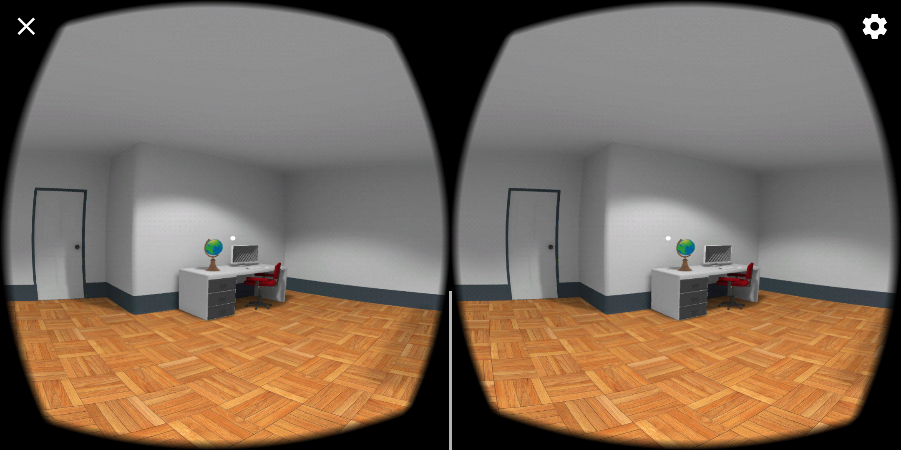
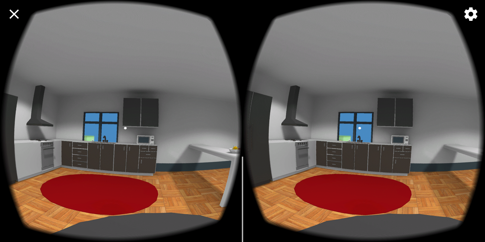
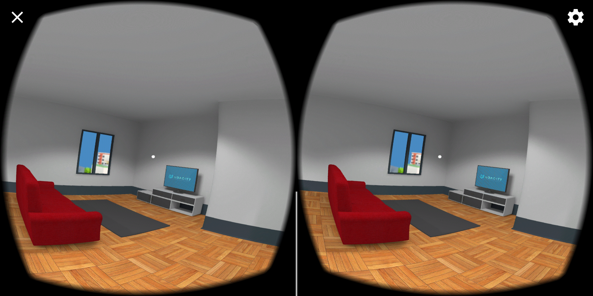

# Build an Apartment

	
	
 	

Starter project for(now out of order) the Udacity [VR Developer Nanodegree](http://udacity.com/vr) program.

This submission is using an **Android** build

- Course: VR Scenes & Objects
- Project: Build an Apartment

### Versions Used
- [Unity LTS Release 2017.4.4](https://unity3d.com/unity/qa/lts-releases?version=2017.4)
- [GVR SDK for Unity v1.100.1](https://github.com/googlevr/gvr-unity-sdk/releases/tag/v1.100.1)

### Directory Structure
- The Unity project is the child directory of the repository and named according to the associated lesson.
- The Unity project is 'cleaned' and includes the `Assets` folder, the `ProjectSettings` folder, and the `UnityPackageManager` folder.

### GVR SDK for Unity
- `GoogleVR` > `Demos` is not included.
- `GoogleVR` > `GVRVideoPlayer.unitypackage` is included.
- Scripts applicable to the course have been updated to reflect Unity's API change from `UnityEngine.VR` to `UnityEngine.XR`.

>**Note:** If for any reason you remove and re-import GVR SDK for Unity v1.100.1, make sure you accept any API update pop-up prompts triggered by Unity. Alternatively, you can manually run the API updater (Unity menu `Assets` > `Run API Updater...`) after the import has completed.

### Related Repositories
- [VR Scenes and Objects - Game Objects](https://github.com/udacity/VR-Scenes-and-Objects_Game-Objects/releases)
- [VR Scenes and Objects - Animations](https://github.com/udacity/VR-Scenes-and-Objects_Animations/releases)
- [VR Scenes and Objects - Cameras](https://github.com/udacity/VR-Scenes-and-Objects_Cameras/releases)
- [VR Scenes and Objects - Lights](https://github.com/udacity/VR-Scenes-and-Objects_Lights/releases)
- VR Scenes and Objects - Build an Apartment

### Personal additional considerations
It didn't take much time to fill up the scene with props and organize everything, approximately one hour, but I had a problem when trying to make shadows appear. Even though every item was checked as static, lights set as baked and shadow type as "soft shadows" I couldn't see any shadow. So I just assumed this is how it should work, giving that I had to turn off every graphical option. After finishing up everything to submit, I changed "Lightmap Resolution" to 80 as requested on the project's rubrics and shadows appeared! I took +- 1:30 hours trying to fix shadows and plus more 30 min finding the city sound so I spend 3 hours in total.

The lesson asked to use "Mobile/Diffuse" shader but the globe was dark with it, so i changed it to Unlit.

### Attributions
[City background sound](https://youtu.be/JxRdrOHL25A?list=PL1h0DrCC72uRfSD9jnKJKQjEo4Moxwd4z)
